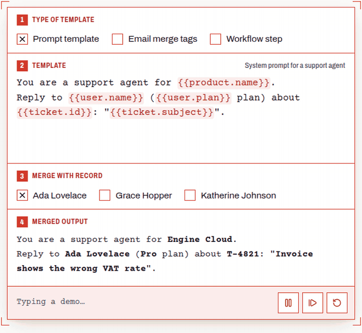

# type-ahead-mention

**Autocomplete for `{{template.variables}}` in React.** Type `{{user.` and see the real value of every key in your data. Drill into nested objects and arrays, get unknown variables underlined as you type, and `@mention` people with async search and avatars. For prompt templates, email merge tags and workflow builders.

[](https://www.npmjs.com/package/type-ahead-mention)
[](https://github.com/rahulpatwa1303/type-ahead-mention/actions/workflows/ci.yml)
[](./LICENSE)

**[Live demo →](https://rahulpatwa1303.github.io/type-ahead-mention/)** · **[Documentation](./packages/core/README.md)** · **[npm](https://www.npmjs.com/package/type-ahead-mention)**



```bash
npm install type-ahead-mention
```

```tsx
import { MentionInput, useMentionResolver } from 'type-ahead-mention';

const data = { user: { name: 'Ada Lovelace', plan: 'Pro' } };

function PromptEditor() {
  const [template, setTemplate] = useState('Reply to {{user.name}}');
  const preview = useMentionResolver(template, data); // "Reply to Ada Lovelace"
  return <MentionInput value={template} onChange={setTemplate} suggestions={data} multiline />;
}
```

See the [full documentation](./packages/core/README.md) for props, theming, the template helpers (`resolveTemplate`, `validateTemplate`), the plain-textarea hook and the CodeMirror extension.

## Repository layout

```
packages/core/   the npm package (source, tests, README)
demo/            the landing page, deployed to GitHub Pages; imports the library from source
```

## Development

```bash
npm install
npm test            # library tests (Vitest)
npm run typecheck
npm run dev:demo    # landing page on localhost
npm run build       # library, then landing page
```

The landing page deploys automatically on every push to `master`. To publish the package, bump `packages/core/package.json` and add a CHANGELOG entry, then run `npm run publish:lib`; `prepublishOnly` typechecks, tests and builds first.

## Contributing

Issues and pull requests are welcome. Please add a test for any behaviour change (`packages/core/test`).

## License

MIT © [Rahul Patwa](https://github.com/rahulpatwa1303)
